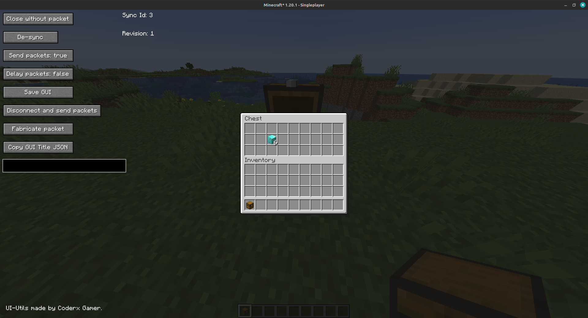
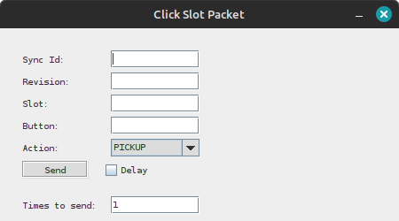
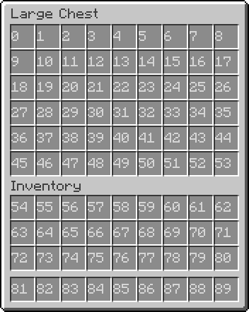
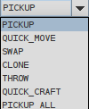
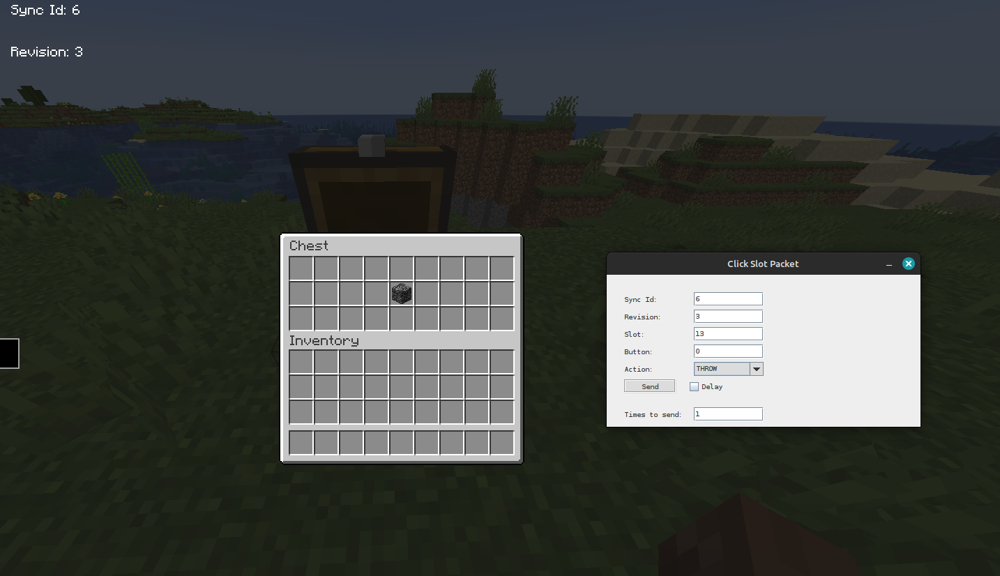
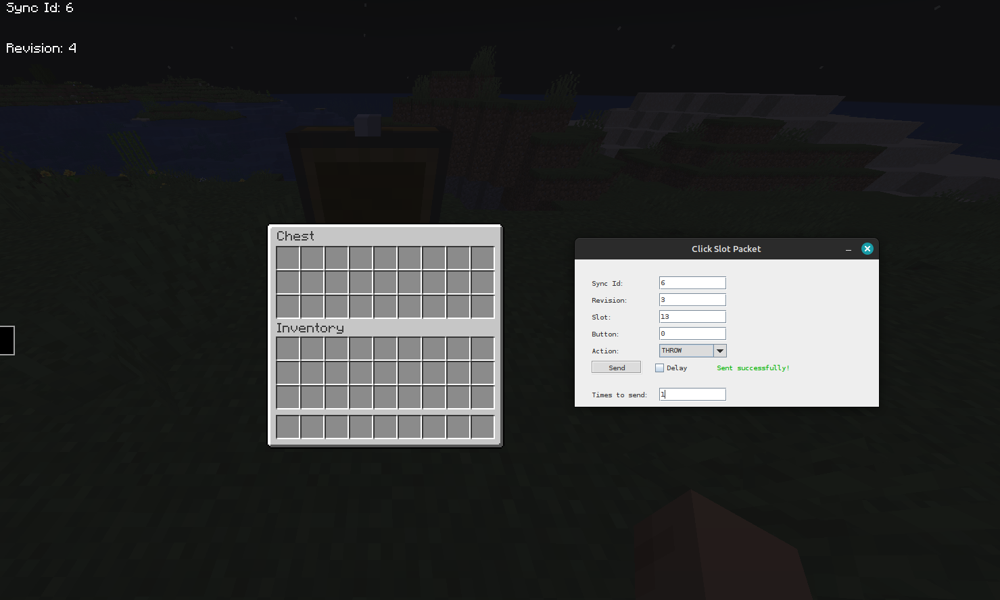
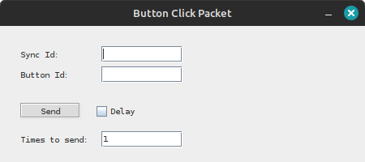
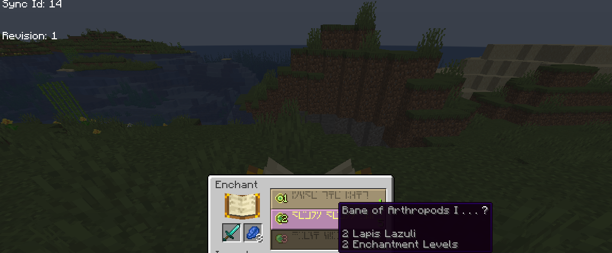
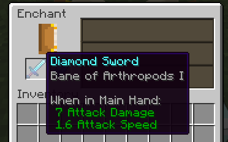

# UI-Utils
Dupe hunting mod. May be incompatible with mac, needs Fabric API.
---

# How to use:

---

- Open any inventory / container with the mod, and you should see some buttons and a text field.

- "Close without packet" closes your current GUI (ScreenHandler) without sending a `CloseHandledScreenC2SPacket` to the server.

- "De-sync" closes your current GUI server-side and keeps it open client-side.

- "Send packets: true/false" tells the client whether it should send any `ClickSlotC2SPacket`(s) and `ButtonClickC2SPacket`(s).

- "Delay packets: true/false" when turned on it will store all `ClickSlotC2SPacket`(s) and `ButtonClickC2SPacket`(s) into a list and will not send them immediately until turned off which sends them all at once.

- "Save GUI" saves your current GUI to a variable and can be accessed by pressing a keybinding in the keybinding options (default key is 'V').

- "Disconnect and send packets" will if "Delay packets" is turned on send the list of stored packets immediately and then disconnect right afterward (can create potential race conditions on non-vanilla servers).

- "Sync Id: ??" is a number used internally to sync various GUI related packets.

- "Revision: ??" is a number used internally to sync various GUI related packets sent from the server to the client.

- "Fabricate packet" allows you to create a custom `ClickSlotC2SPacket` and `ButtonClickC2SPacket` within a window it creates.

- "Copy GUI Title JSON" copies the name of your current GUI in JSON format.

- The text box is a chat field for chatting or running commands while in a GUI.

---

### Fabricate packet tutorial:

---

- `ClickSlotC2SPacket`(s) are what the client sends to the server when clicking any slot in a GUI (e.g. shift clicking an item).

- When clicking the "Fabricate packet" button you should see this window appear (may not work on OSX):

- Clicking "Click Slot" will open up this window:

- Enter the "Sync Id" and "Revision" value you see in the in-game GUI to the "Click Slot Packet" GUI.

- The "Slot" value should be set to what slot you would like to click (starting from 0) you can generally find the location of GUI slots on Google for generic GUI(s), e.g. double chest:

 

- The "Button" field should be set to either: (0 is a left-click, 1 is a right-click, 0-8 and 40 will be explained below).

- The "Action" field should be set to one of these options,

- "PICKUP" puts the item on the slot field on your cursor or vice versa, "QUICK_MOVE" is a shift click, "SWAP" acts as a hotbar or offhand swap (e.g. if your "Action" is set to "SWAP" and the "Button" set to 0-8, it will swap the item in the "Slot" field to one of those hotbar slots (starting from 0) or vice versa, "Button" being set to 40 will swap the item in the "Slot" field to your offhand or vice versa), "CLONE" acts as a middle click to clone items (only works in creative mode), "THROW" drops the item in the "Slot" field, "QUICK_CRAFT" is a bit complicated, so you will have to experiment yourself or look into some code for it, "PICKUP_ALL" will pick up all the items matching to the item on your cursor, as long as "Slot" is within bounds of that GUI.

- The "Send" button will send the packet for with all the info you inputted and will give a response if it was successful or failed to send the packet you provided.

- The "Times to send" field tells the client how many times to send that packet when pressing "Send".

- The delay checkbox tells the client if the packet should wait while "Delay Packets" is on.

---

- Example of this feature:

- When clicking "Send" in the above image, it should drop the bedrock item on the ground.

- Fabricate packet tutorial (Button Click):
---

- `ButtonClickC2SPacket`(s) are what the client sends to the server when clicking a button in a server-side GUI (e.g. clicking an enchantment in an enchantment table).

- When clicking the "Fabricate packet" button you should see this window appear:

- Clicking "Button Click" will open up this window:

- Enter the "Sync Id" field in the "Button Click Packet" GUI as the "Sync Id" value you will see in the in-game GUI.

- Enter the "Button Id" field as what button you would like to click in a GUI (starting from 0.)

- Enter into the field "Times to send" (by default it's one) the amount of packets you would like to send.

- Check the "Delay" checkbox if you would like to delay your packet while "Delay Packets" is on.

- Example of this feature:
---

---

## "^toggleuiutils" command:

---
- Enables/Disables UI-Utils in-game GUI rendering.
---

## Resource Pack Bypassing

---

You can bypass a required resource pack on a server by turning on "Bypass Resource Pack" in the multiplayer screen, if you still get kicked, enable "Force Deny", which will block all resource packs.

---

## Building:

---

You can find building instructions on the UI-Utils website (ui-utils.com).

---

This mod concept is not an original idea, there are similar mods out there that have similar features, the goal of this mod is to be on the latest version and have some additional features.

Some images here may be outdated.

Note that mac may work with most of the mod but not the fabricate packet feature potentially.

That's all the features for this mod currently, there may be more updates in the future but I cannot guarantee.
